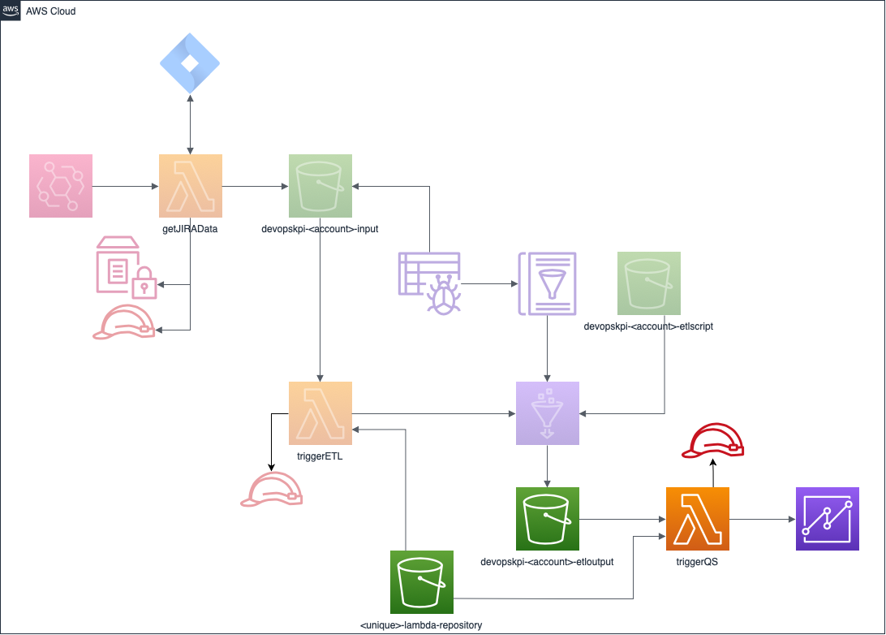

# Trigger QuickSight Lambda

A lambda function that takes the data extracted from the [triggerETL-Lambda](https://github.com/Dazza65/triggerETL-Lambda) project and ingests into AWS QuickSight for visualisation.

This is the final part of an overall solution to provide DevOps Key Performance Indicators on a AWS QuickSight dashboard.
1. [Retrieve the data](https://github.com/Dazza65/getJIRAData)
1. [Transform the data and perform the KPI calculation](https://github.com/Dazza65/triggerETL-Lambda)
1. Ingest the transformed data to QuickSight (This repository)

## Build and deploy

1. Clone the repository
1. Install the following dependencies
    1. [jq](https://stedolan.github.io/jq/)
    1. AWS CLI (v2.0.62)
1. <pre><code>./sh package.sh</code></pre>(Creates the triggerETL.zip file in the build folder)
1. <pre><code>./sh upload.sh</code></pre> (Copies the zip file to the specified S3 bucket to store the lambda function)

1. <pre><code>./sh create-stack.sh</code></pre> (Creates the CloudFormation stack for all of the required resources)

## The following AWS resources are created

1. TODO

## Architecture Diagram

